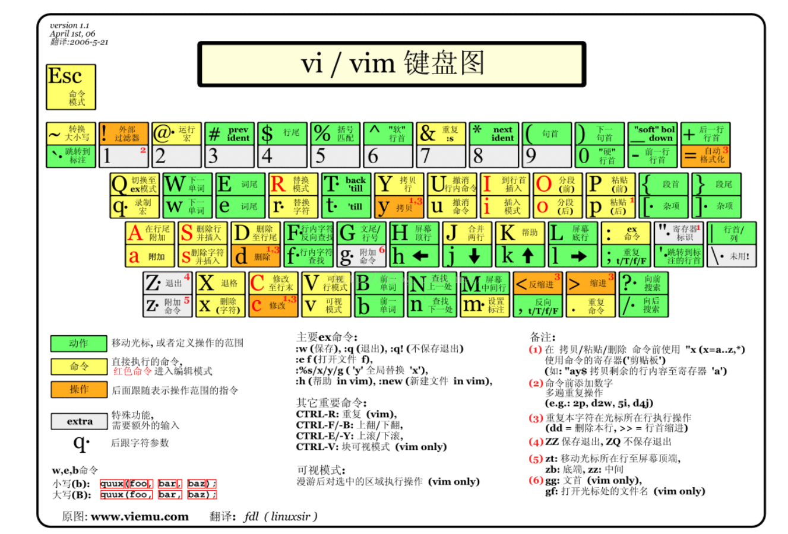

# ideaVim

> 用于基于IntelliJ平台的IDE的Vim仿真插件。

## 源起

平常总喜欢喜欢看一些idea插件，

尤其是看到一些热门的插件，总是想去尝试。

ideaVim就是我最喜欢的插件之一, 它可以很好的提高你的代码效率，

vim语法可以通过键盘完成大部分操作，摆脱鼠标和键盘之间来回切换的桎梏。

## vim语法

> 动作 -- 指示 -- 标记

比如说选择一个单词，只需按下 vaw 就可以选中当前单词,

选择大括号中的内容，va{

